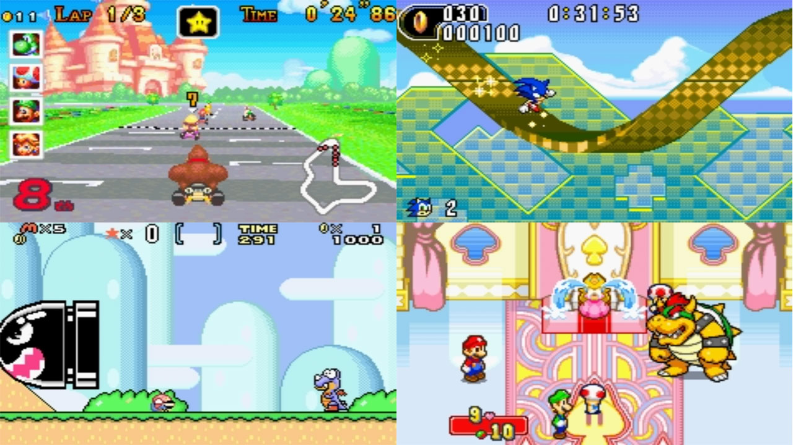
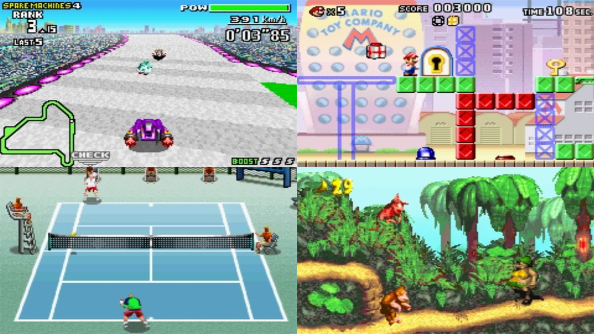

# Nintendo - Game Boy Advance (Meteor)

### Description

Meteor is a Nintendo Gameboy Advance emulator.

### License

GPLv3

### Icon

### Fanart

Help make me fanart!

### Screenshots

### Disclaimer

*Authors: Philippe Daouadi (p.daouadi@free.fr), Hans-Kristian Arntzen (maister@archlinux.us)*
